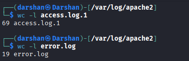

# Apache Web Server Log Analysis

## Objective

Analyze Apache access and error logs to identify suspicious activity, understand web server behavior, and practice manual log investigation techniques.

## Dataset

- access.log.1
- error.log

> **Note:** All requests originated from `127.0.0.1` because the analysis was performed in a local DVWA lab environment. Therefore, source IP attribution was not part of this investigation.

## Tools Used

- grep
- awk
- sort
- uniq
- wc

## Analysis Performed

### 1. Request Volume Analysis

Counted the total number of HTTP requests observed in the access log.

**Findings:** 69 requests and 11 requests were recorded in access and error logs respectively.



---

### 2. HTTP Method Analysis

Observed HTTP methods:

- GET
- POST
- OPTIONS
- PROPFIND
- ZTWJ


GET and POST requests were associated with normal web application usage, while OPTIONS and PROPFIND requests were indicative of reconnaissance activity.

---

### 3. HTTP Status Code Analysis

Observed response codes:

| Status Code | Meaning |
|------------|----------|
| 200 | Successful request |
| 301 | Permanent redirect |
| 302 | Temporary redirect |
| 304 | Not modified |
| 404 | Resource not found |
| 405 | Method not allowed |
| 501 | Method not implemented |


The presence of multiple 404 responses suggests attempts to access resources that were not available on the server.

---

### 4. Suspicious Requests

The following requests were identified during analysis:

```http
GET /.git/HEAD
GET /robots.txt
GET /HNAP1
PROPFIND /
OPTIONS /
```

These requests are commonly associated with reconnaissance and service enumeration activities.

---

### 5. Automated Scanning Activity

The following User-Agent was identified:

```text
Mozilla/5.0 (compatible; Nmap Scripting Engine)
```

This indicates that Nmap NSE scripts were used to perform automated web server reconnaissance.

---

## Findings

The investigation identified two categories of activity:

### Normal Activity

- DVWA login activity
- Access to application pages
- Security configuration changes

### Reconnaissance Activity

- Nmap NSE scanning
- Requests for `.git` resources
- Requests for `robots.txt`
- WebDAV enumeration attempts using PROPFIND
- HTTP method discovery using OPTIONS

No evidence of successful exploitation was observed.

---

## Conclusion

Apache access logs revealed evidence of automated reconnaissance targeting the web application. The activity appears consistent with information gathering and service discovery rather than exploitation. This project demonstrates manual log analysis techniques used to identify suspicious web server activity.

## Skills Demonstrated

- Apache Log Analysis
- Linux Command-Line Investigation
- Threat Detection
- Web Server Monitoring
- Security Documentation
