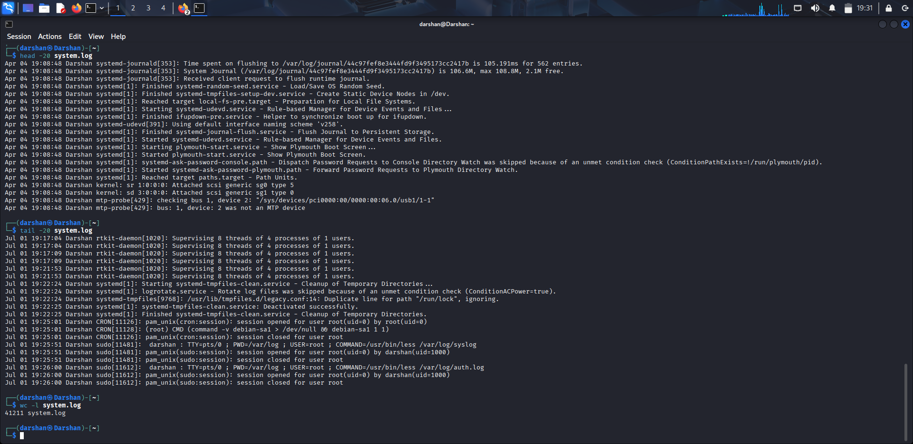
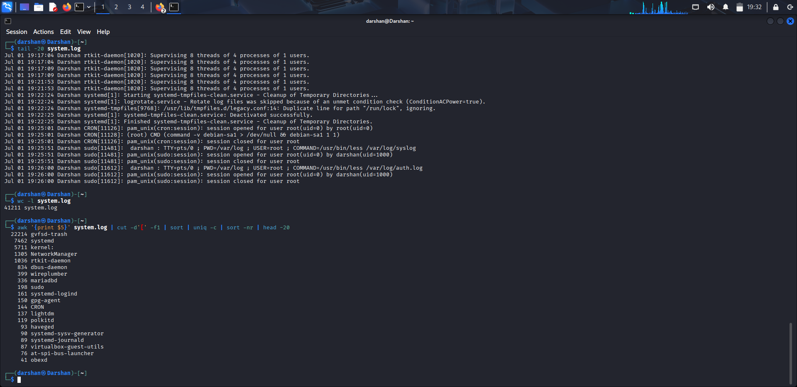
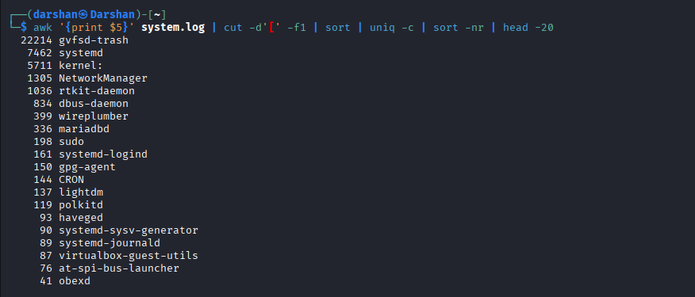

# Linux System Log Analysis

## Objective

Perform manual analysis of Linux system logs to understand system activity, identify authentication events, review service activity, and detect potential security-relevant events using standard Linux command-line utilities.

---

## Dataset

The dataset consists of logs exported from a Kali Linux virtual machine using the `journalctl` utility.

```bash
journalctl > system.log
```

> **Note:** This investigation was conducted in a local lab environment using logs collected from my own Kali Linux system. The log file contains normal operating system events generated by `systemd-journald`.

---

## Tools Used

- journalctl
- grep
- awk
- sort
- uniq
- wc
- less

---

# Analysis Performed

## 1. Dataset Overview

### Command

```bash
head -20 system.log
tail -20 system.log
wc -l system.log
awk '{print $5}' system.log | cut -d'[' -f1 | sort | uniq -c | sort -nr | head -20
```

### Purpose

Determine the total number of log entries available for analysis.

### Finding

41211 log entries were recorded.



---

## 2. Log Structure Inspection

### Commands

```bash
head -20 system.log
```

```bash
tail -20 system.log
```

### Purpose

Inspect the beginning and end of the log file to understand its format, timestamps, and recorded events.


---

## 3. Service Activity Analysis

### Command

```bash
awk '{print $5}' system.log | cut -d'[' -f1 | sort | uniq -c | sort -nr | head
```

### Purpose

Identify the services generating the highest number of log entries.



### Interpretation

The analysis provides an overview of the most active system services during the captured period.

---

## 4. SSH Authentication Analysis

### Commands

```bash
grep sshd system.log
```

```bash
grep "Failed password" system.log
```

```bash
grep "Accepted password" system.log
```

```bash
grep "Invalid user" system.log
```

### Purpose

Investigate SSH authentication attempts and identify successful or failed logins.


### Interpretation

Document whether authentication attempts were observed or if no SSH-related events were present.

---

## 5. Sudo Activity Analysis

### Command

```bash
grep sudo system.log
```

### Purpose

Identify privileged commands executed using `sudo`.


### Interpretation

Review administrative actions performed on the system.

---

## 6. Scheduled Task Analysis

### Commands

```bash
grep CRON system.log
```

```bash
grep cron system.log
```

### Purpose

Identify scheduled task execution.


### Interpretation

Review periodic system jobs and scheduled maintenance activities.

---

## 7. Error Analysis

### Commands

```bash
grep -i error system.log
```

```bash
grep -i fail system.log
```

### Purpose

Search for error messages and failed operations.


### Interpretation

Review system failures, service issues, or authentication failures.

---

## 8. Kernel Message Analysis

### Command

```bash
grep kernel system.log | head -20
```

### Purpose

Inspect kernel-generated log messages.


### Interpretation

Kernel logs provide information about hardware initialization, driver loading, and low-level system events.

---

# Findings

The investigation revealed:

- Linux system activity generated by `systemd-journald`
- Authentication-related events (if any)
- Administrative activity using `sudo`
- Service and daemon activity
- Kernel initialization messages
- Scheduled task execution
- Error and warning messages (if present)

No evidence of malicious activity was identified during this investigation unless explicitly observed in the collected logs.

---

# Conclusion

This project demonstrates manual Linux system log analysis using native command-line tools. The investigation focused on understanding log structure, reviewing authentication events, analyzing service activity, and identifying potential security-relevant events. Such analysis forms a fundamental skill for SOC analysts during incident investigation and threat hunting.
